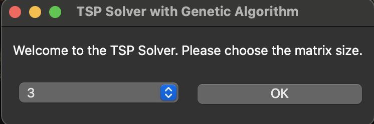
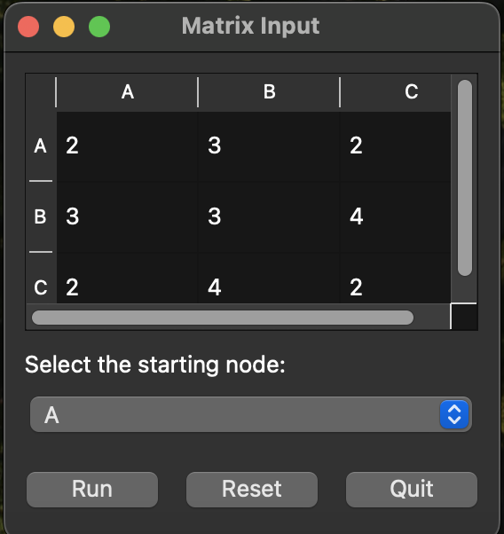
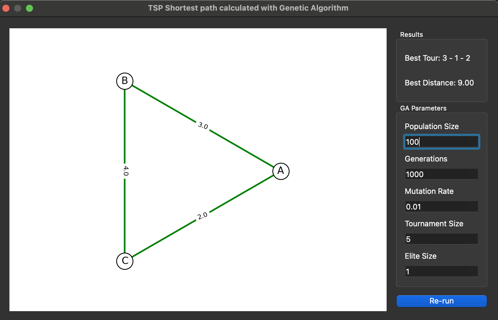

# Traveling Salesman Problem Solver

## Table of Contents

- [Overview](#overview)
- [Features](#features)
- [Screenshots](#screenshots)
- [Installation](#installation)
- [Usage](#usage)
- [Contributing](#contributing)
- [License](#license)

## Overview

This desktop application is built with PySide6 to solve the Traveling Salesman Problem (TSP) using a Genetic Algorithm. The app provides an intuitive interface for users to input their data and find an optimal solution to the TSP.

## Features

- **Genetic Algorithm:** The app employs a Genetic Algorithm to find an optimal solution to the TSP.
- **Interactive Interface:** Users can easily input their TSP data and visualize the results through the interactive graphical interface.
- **Configurable Parameters:** The Genetic Algorithm parameters are configurable, allowing users to experiment with different settings.
- **Result Visualization:** The app displays the optimized route and relevant statistics to help users understand the solution.

## Screenshots








## Installation

### Prerequisites

- [Python 3.9](https://www.python.org/downloads/)
- [pip](https://pip.pypa.io/en/stable/installing/)
- [Git](https://git-scm.com/downloads)
- [PySide6](https://pypi.org/project/PySide6/)
- [Matplotlib](https://pypi.org/project/matplotlib/)
- [NumPy](https://pypi.org/project/numpy/)
- [Pandas](https://pypi.org/project/pandas/)
- [PyQtGraph](https://pypi.org/project/pyqtgraph/)


### Steps

1. Clone the repository:

    ```bash
    git clone https://github.com/Alibakhshov/TSP-with-Genetic-Algorithm
    ```

2. Navigate to the project directory:

    ```bash
    cd your-repo
    ```

3. Install the required dependencies:

    ```bash
    pip install -r requirements.txt
    ```

## Usage

1. Run the application:

    ```bash
    python main.py
    ```

2. Input your TSP data through the graphical interface.

3. Configure Genetic Algorithm parameters if desired.

4. Click the "Run" button to start the optimization process.

5. View the optimized route and statistics in the results section.

## Contributing

If you'd like to contribute to this project, please follow the [Contribution Guidelines](CONTRIBUTING.md).

## License

This project is licensed under the [MIT License](LICENSE).
